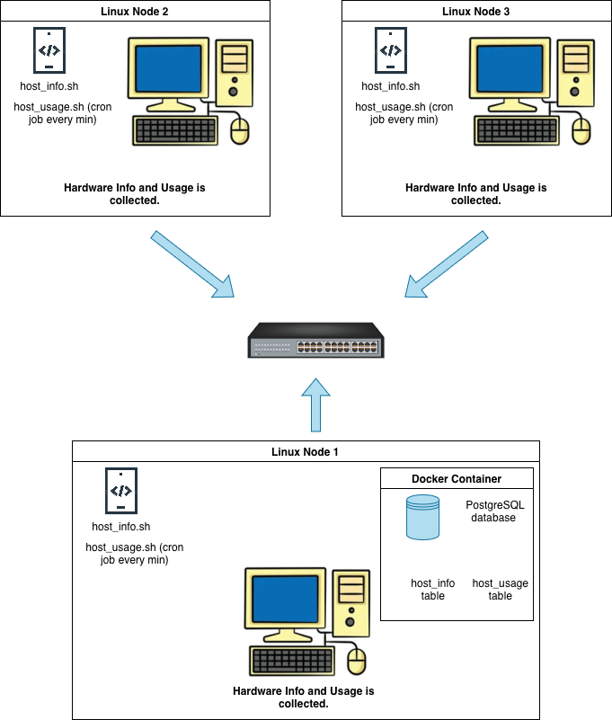

# Linux Cluster Monitoring Agent

## Introduction
The Linux Cluster Monitoring Agent is a monitoring solution designed for the Jarvis Linux Cluster Administration (LCA) team. 
It collects hardware specifications and real-time resource usage (e.g., CPU and memory) from each server node in a Rocky Linux cluster. 
The collected data is stored in a PostgreSQL database, where it can be queried to support reporting and future resource-planning decisions such as scaling the cluster.

This project acts as an MVP, helping the LCA team track cluster performance and gain insights from historical usage data.

**Technologies Used**: Bash, Git, Docker, PostgreSQL, Crontab

## Quick Start
Here are the steps to quickly get your monitoring agent setup and 
collecting information on your machine.
```
#Create a psql instance using psql_docker.sh:
bash scripts/psql_docker.sh create db_username db_password

#Start the psql instance using psql_docker.sh:
bash scripts/psql_docker.sh start 

#Stop the psql instance using psql_docker.sh:
bash scripts/psql_docker.sh stop 

#Initialize the database using ddl.sql:
psql -h localhost -U postgres -d host_agent -f sql/ddl.sql

#Store hardware specific data into the database:
bash scripts/host_info.sh "localhost" 5432 "host_agent" "postgres" "password"

#Store hardware usage data into the database:
bash scripts/host_usage.sh "localhost" 5432 "host_agent" "postgres" "password"

#Setup crontab to collect hardware usage data continuously:
crontab -e #open cron editor

#to run host_usage.sh every minute, make sure to enter the correct file location
* * * * * bash /path/file/to/scripts/host_usage.sh localhost 5432 host_agent psotgres password > /tmp/host_usage.log

#check that the job was saved into the crontab
```crontab -l```

#Validate your results are being stored into the psql instance
psql -h  #etc...
SELECT * FROM host_usage;
```

## Implementation
To deploy PostgreSQL using Docker, I created a psql_docker.sh script that handles container creation, start, and stop commands. 
A persistent Docker volume stores the database data so it remains intact even if the container is removed. After launching the container, 
I executed a ddl.sql script to create the project schema, which includes host_info for hardware information and host_usage for system usage metrics. 
Two Bash scripts were developed to collect these metrics: host_info.sh runs once to insert hardware specs into the database, while host_usage.sh is scheduled using crontab to run every minute to capture CPU and disk usage. 
Both scripts utilize Linux utilities such as lscpu, vmstat, and df, and insert results into PostgreSQL via CLI commands.

## Architecture


## Scripts
Script to create, start and stop your psql docker instance 
```
bash scripts/psql_docker.sh start|stop|create [db_username] [db_password]
 
#create psql container
bash scripts/psql_docker.sh create db_username db_password
 
#start container
bash scripts/psql_docker.sh start
 
#stop container
bash scripts/psql_docker.sh stop
```

DDL script (Data Definition Language) that will initialize the host_agent 
database with the two tables host_info and host_usage
```
psql -h localhost -U postgres -d host_agent -f sql/ddl.sql
```

Script to collects host machine information and inserts it into psql instance:
```
#script usage
bash scripts/host_info.sh psql_host psql_port db_name psql_user psql_password

#example
bash scripts/host_info.sh "localhost" 5432 "host_agent" "postgres" "password"
```
Script to collects host usage information and inserts it into psql instance:
```
#script usage
bash scripts/host_usage.sh psql_host psql_port db_name psql_user psql_password

#example
bash scripts/host_usage.sh "localhost" 5432 "host_agent" "postgres" "password"
```
Cron job to execute run host_usage.sh every minute:
```
# open cron editor
crontab -e 

#to run host_usage.sh every minute, make sure to enter the correct file location
* * * * * bash /path/file/to/scripts/host_usage.sh localhost 5432 host_agent psotgres password > /tmp/host_usage.log
```

## Database Modeling
Here are the database schemas for the two tables that were created.

#### host_info
| Column           | Type             | Description                                  |
|-----------------|-----------------|---------------------------------------------|
| id               | INTEGER          | Unique identifier for each host (Primary Key) |
| hostname         | VARCHAR          | Fully qualified hostname of the node        |
| cpu_number       | SMALLINT         | Number of CPU cores                          |
| cpu_architecture | VARCHAR          | CPU architecture (e.g., x86_64)             |
| cpu_model        | VARCHAR          | CPU model name                               |
| cpu_mhz          | DOUBLE PRECISION | CPU speed in MHz                             |
| l2_cache         | INTEGER          | L2 cache size in KB                          |
| total_mem        | INTEGER          | Total system memory in KB                    |
| timestamp        | TIMESTAMP        | Time when host info was recorded             |


#### host_usage
| Column         | Type       | Description                                 |
|----------------|-----------|---------------------------------------------|
| host_id        | INTEGER   | References `id` in `host_info`              |
| memory_free    | INTEGER   | Free memory in MB                           |
| cpu_idle       | SMALLINT  | Percentage of CPU idle time                 |
| cpu_kernel     | SMALLINT  | Percentage of CPU time spent in kernel mode |
| disk_io        | INTEGER   | Number of disk I/O operations               |
| disk_available | INTEGER   | Available disk space in MB                  |
| timestamp      | TIMESTAMP | Time when usage metrics were recorded       |


## Test
I tested each script of this project one by one as implementation occurred.
After I created the psql_docker script, I checked with docker ps to verify if the jrvs-sql container was created and running. 

I manually tested whether the stop and start actions worked as well.
Then, for the ddl.sql, host_info.sh, and host_usage.sh scripts, I would run them and then confirm with the psql CLI that the tables were created and populated with the data pulled from the scripts.
For the cron job, 

I would verify with the crontab -l command that our job was saved, and then check in the psql CLI that the data was being pulled in.

## Deployment
The app is deployed on Github, storing out scripts and for using the Github flow architecture. 
Where we each feature was made separately in respective feature branches to provide version control and isolate our workflows.

Docker was used to containerize the project so that it uses a consistently postgres image allowing it to work on many machines and not just the working machine.
We used crontab to create our cron job to automate our `host_usage.sh` script to be called every minute so we can actively collect data on the machines.

## Improvements
- The host_info script can be updated to detect changes in hardware specs and update the existing host record instead of only inserting once.
- Adding Monitoring Alerts would enhance this projects value by not only providing usage data 
but also notifying the team when a threshold has been crossed to allow for action and investigation. 
- The crontab job being run every minute will lead to large growth in storage over time. 
Future improvements can tackle this issue by implementing data could implement data retention policies to archive or delete older data.